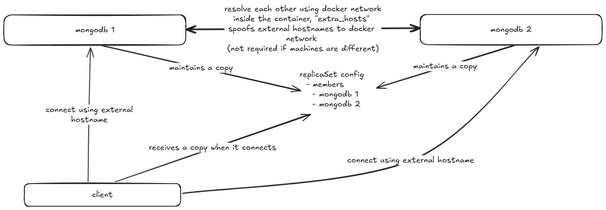

### Authentication
- In mongodb, using authentication with replicas requires a keyfile. Path to the keyfile must be provided.
- Base mongodb image does not have security file so we create a keyfile and copy it. The file permissions must also be adjusted so that mongodb can access it

### Networking
- Replica configuration includes a list of all members
- Each member has a `host` property
- Mongodb shares this list with all clients that connect to it
- This means, each host must be accessible from all the other members, as well as by all the clients
- Inside the containers, we can use docker compose `extra_hosts` configuration to make any given host string point to another place
- Therefore, all we need to do is choose hostnames that are accessible from the public for the replicaset configuration; and then we will use `extra_hosts` to make these hostnames point to internal docker hostnames as per the need. 

\
